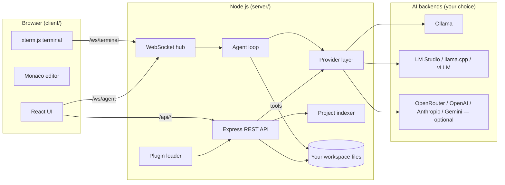
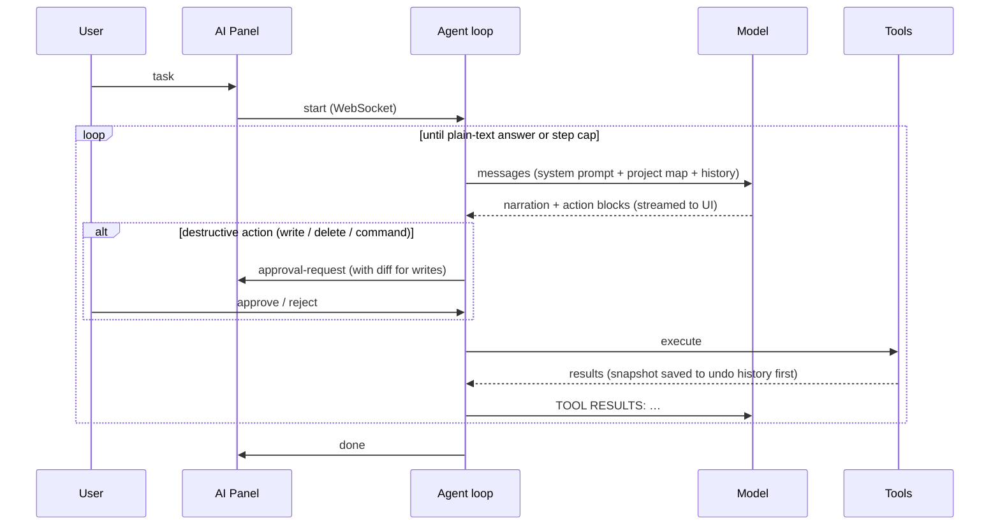
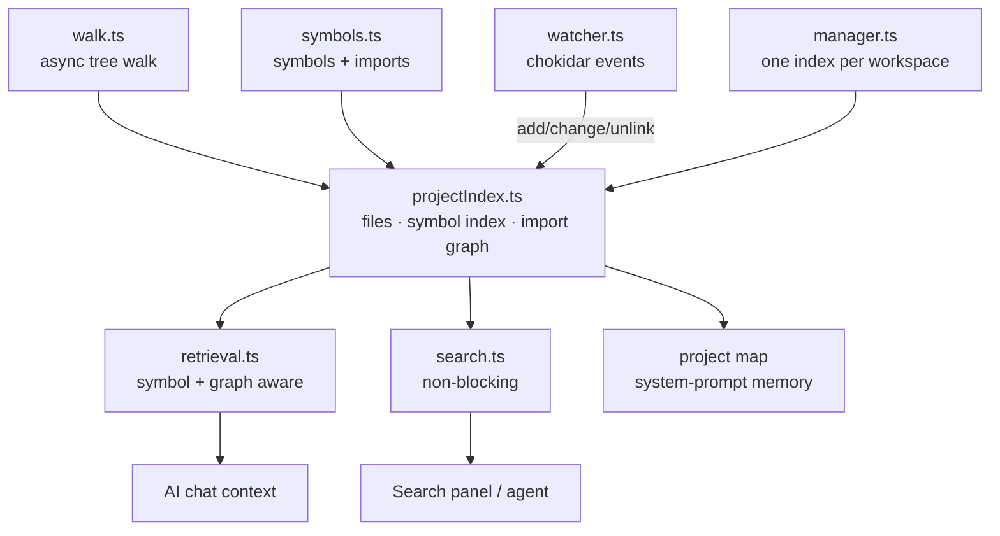

# Architecture

Emerald Code Studio is two small programs that talk over localhost:



Everything runs on your machine. The server binds `127.0.0.1` only; the sole
outbound traffic is to the model endpoints you configure.

## Repository layout

```
server/src/
  index.ts            entry point; wires routes, websockets, plugins, static client
  config.ts           settings + AES-256-GCM encrypted secret store
  terminal.ts         shell over WebSocket (node-pty if present, pipe fallback)
  plugins.ts          plugin discovery and the PluginApi surface
  util/paths.ts       safeJoin() workspace jail + ignore lists
  util/exec.ts        shell-free child process helper
  routes/             one file per REST area: fs, search, git, ai, index,
                      conversations, settings
  providers/          the AI backend layer (see below)
  agent/              protocol.ts (action parsing), tools.ts (execution +
                      undo history), agent.ts (the loop over WebSocket)
  intelligence/       project understanding — see "Project intelligence" below:
                      walk.ts (async walker + concurrency pool),
                      symbols.ts (symbol & import extraction),
                      projectIndex.ts (incremental index + import graph),
                      watcher.ts (chokidar → incremental updates),
                      manager.ts (per-workspace index lifecycle),
                      retrieval.ts (symbol/graph-aware context selection),
                      search.ts (non-blocking content search),
                      detect.ts (framework detection)

client/src/
  main.tsx            bootstrap; loads monacoSetup (offline Monaco bundling)
  App.tsx             layout + global keyboard shortcuts
  api.ts              typed fetch/SSE helpers
  state/store.ts      zustand store: tabs, settings, panels
  components/         one file per UI region (Explorer, EditorArea, AIPanel,
                      TerminalView, GitPanel, SettingsModal, …)
```

## The provider layer

`providers/types.ts` defines the entire contract:

```ts
interface Provider {
  streamChat(messages, opts): AsyncIterable<string>;
  complete(prefix, suffix, opts): Promise<string>;
  listModels(): Promise<string[]>;
}
```

Four implementations ship in-tree: `ollama` (native API), `openai-compatible`
(covers LM Studio, llama.cpp server, vLLM, OpenRouter, OpenAI), `anthropic`,
and `gemini`. `registry.ts` maps a settings entry to an implementation, and
`registerProviderKind()` lets plugins add new kinds without touching core.

Model switching is instant because providers are constructed per request from
current settings — there is no long-lived connection to invalidate.

## The agent

Local models rarely support provider-specific function calling, so the agent
uses a **text protocol** any model can speak (see `agent/protocol.ts`): the
model emits ```` ```action ```` fenced JSON blocks, the server parses and
executes them, and appends results as the next user message. The loop:



Safety properties:

- **Workspace jail** — every tool path goes through `safeJoin()`, which
  rejects anything resolving outside the workspace.
- **Approval gates** — `write_file` always shows a diff; `run_command` and
  `delete_file` prompt according to your Settings. Dependency installs are a
  separately toggleable category.
- **Undo** — before any write or delete, the previous content is snapshotted
  (`agent/tools.ts`). The History panel rolls back any change.
- **Step cap** — a user-editable setting, not a product limit.

## Project intelligence

This layer is what makes Emerald understand *projects*, not just files. It is
built once asynchronously and then kept live by a file watcher.



- **Async walk** (`walk.ts`): traverses with `fs/promises` and a bounded
  concurrency pool, so indexing a large repo never blocks the event loop.
  Symlinks are skipped (no cycles, no escaping the workspace).
- **Symbol & import extraction** (`symbols.ts`): language-dispatched, heuristic
  (regex) extraction of functions, classes, interfaces, types, React
  components, HTTP routes, Python/PHP defs, and WordPress hooks — plus import
  specifiers. Zero native deps, instant start, cross-platform. Swap in
  tree-sitter later by replacing this one module.
- **Incremental index** (`projectIndex.ts`): holds every file, an inverted
  *symbol name → files* index, and a resolved *import graph* (both directions).
  `updateFile()` / `removeFile()` patch all three for a single file, so a save
  re-indexes one file, not the tree.
- **Background watcher** (`watcher.ts`): chokidar (reliable cross-platform)
  feeds debounced incremental updates. No polling, no TTL — the index is always
  current. Closed on graceful shutdown.
- **Detection** (`detect.ts`): frameworks, languages, package manager, build
  tools — from marker files only; nothing is executed.
- **Project map**: a compact markdown tree + facts + the most depended-on
  modules and their symbols, injected as system-prompt memory into every chat
  and agent run.
- **Retrieval** (`selectContext` in `retrieval.ts`): ranks files by defined
  **symbols** (a query naming `parseActions` finds the file that defines it,
  regardless of filename), path/filename terms, a content-search fallback for
  string literals, and **import-graph proximity** (related files come along).
  Large files are inlined as a symbol outline instead of full text. This
  replaced the old filename-substring matching. Swap it for embeddings by
  replacing this one function — the index already holds the substrate.
- **Search** (`search.ts`): reads candidate files from the index with bounded
  concurrency via `fs/promises` — non-blocking, and no re-walk of the tree.

## Extension points (stable surfaces)

| To add… | Touch |
|---|---|
| An AI provider kind | one file in `server/src/providers/` + one line in `registry.ts`, **or** a plugin calling `registerProviderKind()` |
| An agent tool | `agent/tools.ts` (`executeTool` switch) + one line in the system prompt in `agent/protocol.ts` |
| An HTTP API | a router file in `server/src/routes/`, mounted in `index.ts`, **or** a plugin `addRoute()` |
| A theme | a `:root[data-theme='name']` block in `client/src/styles.css` |
| A command | `CommandPalette.tsx` commands array, or a plugin `addCommand()` |
| A framework detector | `intelligence/detect.ts` |

## Design rules

1. **The browser never touches disk or models directly** — everything goes
   through the server, so the security chokepoints stay in one process.
2. **Providers are dumb pipes** — no prompt logic lives in them.
3. **Prompts live in exactly two places** — `agent/protocol.ts` and
   `routes/aiRoutes.ts`.
4. **No hidden state** — settings, secrets, history, and conversations are
   plain files in `~/.emerald-code-studio` (secrets encrypted).
5. **Nothing phones home.** Adding telemetry is a rejected-PR category.
