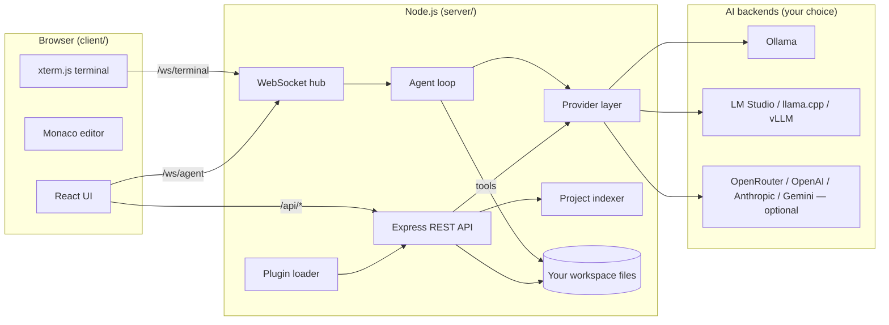
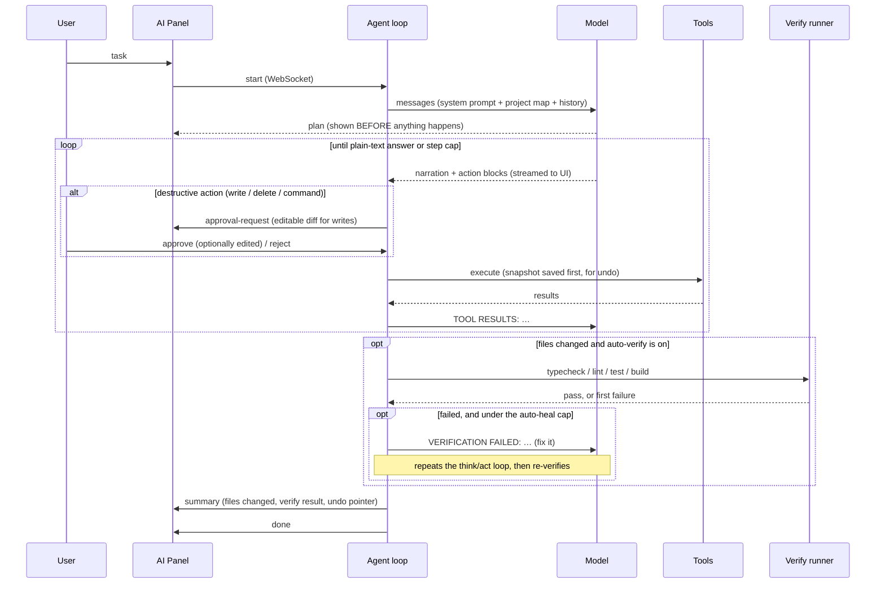
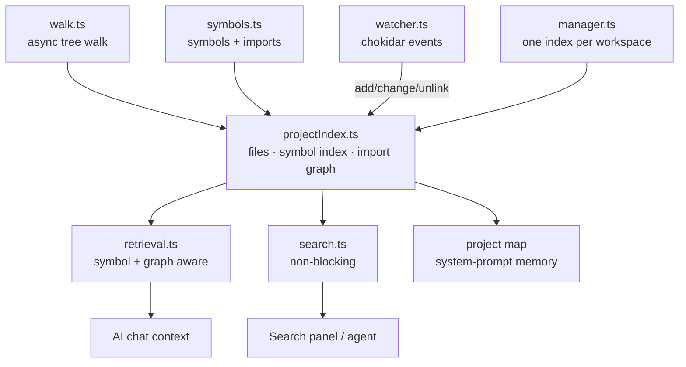

# Architecture

Emerald Code Studio is two small programs that talk over localhost:



Everything runs on your machine. The server binds `127.0.0.1` only; the sole
outbound traffic is to the model endpoints you configure.

## Repository layout

```
server/src/
  index.ts            entry point; wires routes, websockets, plugins, static client
  config.ts           settings + AES-256-GCM encrypted secret store
  terminal.ts         shell over WebSocket (node-pty if present, pipe fallback)
  tasks.ts            long-running task manager (dev servers, watch builds)
  plugins.ts          plugin discovery and the PluginApi surface
  util/paths.ts       safeJoin() workspace jail + ignore lists
  util/exec.ts        shell-free child process helper
  util/proc.ts        killTree() — tree-kill a process and everything it spawned
  util/atomic.ts      writeFileAtomic() + withLock() — crash-safe writes
  verify/             detect.ts (typecheck/lint/test/build script detection),
                      runner.ts (cancellable, timeout-safe step execution)
  memory/             memory.ts — local, per-project, relevance-filtered memory
  routes/             one file per REST area: fs, search, git, ai, index,
                      conversations, settings, verify, tasks, memory, graph
  providers/          the AI backend layer (see below)
  agent/              protocol.ts (plan + action parsing), tools.ts (execution,
                      undo history, checkpoints), summary.ts (final-summary
                      builder), agent.ts (the loop over WebSocket)
  intelligence/       project understanding — see "Project intelligence" below:
                      walk.ts (async walker + concurrency pool),
                      symbols.ts (symbol & import extraction),
                      projectIndex.ts (incremental index + import graph),
                      watcher.ts (chokidar → incremental updates),
                      manager.ts (per-workspace index lifecycle),
                      retrieval.ts (symbol/graph-aware context selection),
                      search.ts (non-blocking content search),
                      graph.ts (visual graphs derived from the index),
                      detect.ts (framework detection)

client/src/
  main.tsx            bootstrap; loads monacoSetup (offline Monaco bundling)
  App.tsx             layout + global keyboard shortcuts
  api.ts              typed fetch/SSE helpers (streamChat, streamSSE)
  state/store.ts      zustand store: tabs, settings, panels, verify/task status
  components/         one file per UI region (Explorer, EditorArea, AIPanel,
                      TerminalView, GitPanel, VerifyPanel, TasksPanel,
                      HistoryPanel, MemoryPanel, GraphView, SettingsModal, …)
```

## The provider layer

`providers/types.ts` defines the entire contract:

```ts
interface Provider {
  streamChat(messages, opts): AsyncIterable<string>;
  complete(prefix, suffix, opts): Promise<string>;
  listModels(): Promise<string[]>;
}
```

Four implementations ship in-tree: `ollama` (native API), `openai-compatible`
(covers LM Studio, llama.cpp server, vLLM, OpenRouter, OpenAI), `anthropic`,
and `gemini`. `registry.ts` maps a settings entry to an implementation, and
`registerProviderKind()` lets plugins add new kinds without touching core.

Model switching is instant because providers are constructed per request from
current settings — there is no long-lived connection to invalidate.

## The agent — transparent, self-verifying, cancellable

Local models rarely support provider-specific function calling, so the agent
uses a **text protocol** any model can speak (see `agent/protocol.ts`): the
model emits ```` ```plan ```` and ```` ```action ```` fenced blocks, the server
parses and executes them, and appends results as the next user message.



**Transparency contract**: the agent must plan before it acts (the system
prompt requires a ` ```plan ` block before the first action of non-trivial
work — see `agentSystemPrompt` in `protocol.ts`), every destructive action is
shown and approved individually, and every run ends with a factual summary
(`agent/summary.ts` — a pure, deterministic function, so it never depends on
the model remembering to explain itself).

**Modify, not just approve/reject**: the diff shown for `write_file` is
editable in the UI (`AIPanel.tsx`'s `DiffEditor` with `readOnly: false` on the
modified side). Whatever is in the editor when you click Apply is what gets
written — `executeTool`'s `editedContent` parameter always wins over the
model's own proposed content.

**Self-healing loop**: if the agent changed any files and Settings →
"Auto-verify" is on, `verify/runner.ts` runs the project's detected
typecheck/lint/test/build scripts. A failure is handed back to the model as a
new turn (bounded by "Max auto-fix attempts" — a real cap, not a suggestion).
Each phase — the initial task and every heal round — gets its **own** full
step budget (`agentMaxSteps`); sharing one counter across heal rounds would
mean a task that used its whole budget just finishing the primary work leaves
zero steps for healing.

**Cancellation actually kills things**: `{type:'cancel'}` aborts whatever is
in flight right now — the model's stream, a running verification step, or a
running `run_command` — via a shared `AbortController` threaded all the way
into `runStep`/`runInWorkspace`, which `killTree()` the process (and anything
it spawned) immediately rather than waiting for a timeout. Verified live: a
verification step that would otherwise hang forever is killed within ~2
seconds of cancelling, with no orphaned process left behind.

Safety properties:

- **Workspace jail** — every tool path goes through `safeJoin()`, which
  rejects anything resolving outside the workspace (symlink-aware, see
  Security below).
- **Approval gates** — `write_file` always shows an editable diff;
  `run_command` and `delete_file` prompt according to your Settings.
  Dependency installs are a separately toggleable category.
- **Undo, two granularities** — every write/delete snapshots the previous
  content (`agent/tools.ts`). The History panel rolls back any single file, or
  a whole agent run (including every auto-heal round) as one **checkpoint** —
  restoring to each file's state from *before the run's first change to it*,
  not just its most recent snapshot.
- **Step cap** — a user-editable setting, not a product limit.

## Project intelligence

This layer is what makes Emerald understand *projects*, not just files. It is
built once asynchronously and then kept live by a file watcher.



- **Async walk** (`walk.ts`): traverses with `fs/promises` and a bounded
  concurrency pool, so indexing a large repo never blocks the event loop.
  Symlinks are skipped (no cycles, no escaping the workspace).
- **Symbol & import extraction** (`symbols.ts`): language-dispatched, heuristic
  (regex) extraction of functions, classes, interfaces, types, React
  components, HTTP routes, Python/PHP defs, and WordPress hooks — plus import
  specifiers. Zero native deps, instant start, cross-platform. Swap in
  tree-sitter later by replacing this one module.
- **Incremental index** (`projectIndex.ts`): holds every file, an inverted
  *symbol name → files* index, and a resolved *import graph* (both directions).
  `updateFile()` / `removeFile()` patch all three for a single file, so a save
  re-indexes one file, not the tree.
- **Background watcher** (`watcher.ts`): chokidar (reliable cross-platform)
  feeds debounced incremental updates. No polling, no TTL — the index is always
  current. Closed on graceful shutdown.
- **Detection** (`detect.ts`): frameworks, languages, package manager, build
  tools — from marker files only; nothing is executed.
- **Project map**: a compact markdown tree + facts + the most depended-on
  modules and their symbols, injected as system-prompt memory into every chat
  and agent run.
- **Retrieval** (`selectContext` in `retrieval.ts`): ranks files by defined
  **symbols** (a query naming `parseActions` finds the file that defines it,
  regardless of filename), path/filename terms, a content-search fallback for
  string literals, and **import-graph proximity** (related files come along).
  Large files are inlined as a symbol outline instead of full text. This
  replaced the old filename-substring matching. Swap it for embeddings by
  replacing this one function — the index already holds the substrate.
- **Search** (`search.ts`): reads candidate files from the index with bounded
  concurrency via `fs/promises` — non-blocking, and no re-walk of the tree.

## Verification and tasks

Two small subsystems back the "make the project green" and "run things
reliably" requirements:

- **`verify/detect.ts` + `verify/runner.ts`** — detects typecheck/lint/test/build
  scripts from `package.json` + lockfile evidence (falling back to a bare
  `tsc --noEmit` when there's a tsconfig but no script), then runs them
  in order, streaming output, stopping at the first failure. Every step is
  spawned in its own process group so it can be killed as a tree — a hung
  watch-mode test runner, or a user hitting Cancel, can't leave orphans.
  `CI=1` is set so tools that only avoid watch-mode with a detected CI
  environment behave correctly; the timeout (and now the cancel signal) is
  the hard backstop regardless.
- **`tasks.ts`** — long-running processes (dev servers, watch builds) as
  first-class, trackable tasks distinct from the interactive terminal and
  from one-off agent commands: start/stop/restart, live log streaming (SSE),
  and killed as a tree on stop *and* on server shutdown (`killAllTasks()`).

Both share `util/proc.ts`'s `killTree()` — one implementation of "kill this
process and everything it spawned," used by verification, tasks, and the
agent's `run_command`, instead of three slightly-different copies.

## Project memory

`memory/memory.ts` is the IDE's long-term, per-project understanding: a plain
JSON file under the data dir keyed by a hash of the workspace path. It holds
architecture notes, conventions, preferences, important files, known bugs,
agent-recorded prior fixes, and decisions, plus an auto-refreshed detection
snapshot. It is **local-only, inspectable, editable** (the Memory panel is a
direct editor over it), **project-specific**, and **safe to reset**.

The load-bearing rule is that memory is **never dumped wholesale into a
prompt**. `memoryContext(mem, query, touchedFiles)` builds the block that goes
to a model, and it relevance-filters every unbounded list: a prior fix, known
bug, important file, or decision is included only if its text overlaps the
query (stopword-filtered, so "the"/"fix"/"change" don't cause spurious
matches) or it involves a file the task is touching. Only the small, global
guidance fields — architecture, conventions, preferences — are always
included when set, because that is the entire point of them.

Integration:
- **Agent plans with memory** — the relevant slice is appended to the agent's
  system prompt (`agent/agent.ts`) and the chat system prompt
  (`routes/aiRoutes.ts`).
- **Agent updates memory after a run** — `recordAgentRun()` appends a prior
  fix (task summary + files) after any run that changed files; a verification
  failure that was healed and then passed is also recorded as a resolved
  known-bug, so "self-healing results are saved into memory when useful."
- **Retrieval is unchanged** — memory is guidance; the file *content* the
  agent reads still comes from the symbol/import-graph retriever.

## Visual project graphs

`intelligence/graph.ts` reshapes what the index already knows (files, symbols,
in/out import edges) into node/edge graphs — it adds **no** new parsing or
walking, so the graph is always consistent with retrieval and stays live via
the same watcher. Graph types: `imports` (file dependency graph, nodes tagged
component/route/hook/file by their strongest symbol), `components`, `routes`,
`hooks` (symbol nodes linked to their defining file), and `focus` (one file
plus its direct graph neighbours). Node count is capped (keeping the most
connected nodes) so graphs stay readable and the client-side layout stays
fast. `availableGraphs()` reports which types actually have data, so the UI
only offers real tabs.

The client (`components/GraphView.tsx`) runs a small dependency-free,
deterministically-seeded force-directed layout for a fixed number of
iterations and renders static SVG — no animation loop, nothing to leak — with
draggable nodes, wheel zoom, and click-to-open-file.

*Limitation:* the symbol extractor is line-based, so multiple routes/hooks
declared on a single source line surface only the first. Real code is
one-per-line; this is the same heuristic tradeoff documented for the index.
Data-flow graphs beyond the import/dependency graph are not attempted.

## Extension points (stable surfaces)

| To add… | Touch |
|---|---|
| An AI provider kind | one file in `server/src/providers/` + one line in `registry.ts`, **or** a plugin calling `registerProviderKind()` |
| An agent tool | `agent/tools.ts` (`executeTool` switch) + one line in the system prompt in `agent/protocol.ts` |
| An HTTP API | a router file in `server/src/routes/`, mounted in `index.ts`, **or** a plugin `addRoute()` |
| A theme | a `:root[data-theme='name']` block in `client/src/styles.css` |
| A command | `CommandPalette.tsx` commands array, or a plugin `addCommand()` |
| A framework detector | `intelligence/detect.ts` |
| A retrieval strategy | implement `Retriever` (`intelligence/retrieval.ts`) and call `setRetriever()` — a plugin can do this via `api.setRetriever()` |

## Design rules

1. **The browser never touches disk or models directly** — everything goes
   through the server, so the security chokepoints stay in one process.
2. **Providers are dumb pipes** — no prompt logic lives in them.
3. **Prompts live in exactly two places** — `agent/protocol.ts` and
   `routes/aiRoutes.ts`.
4. **No hidden state** — settings, secrets, history, and conversations are
   plain files in `~/.emerald-code-studio` (secrets encrypted).
5. **Nothing phones home.** Adding telemetry is a rejected-PR category.
